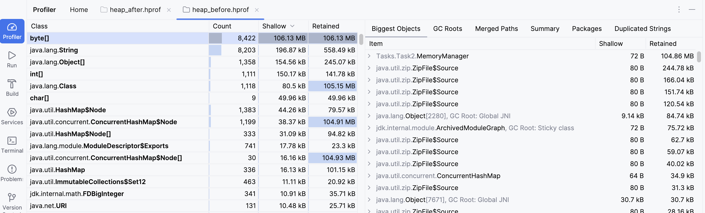
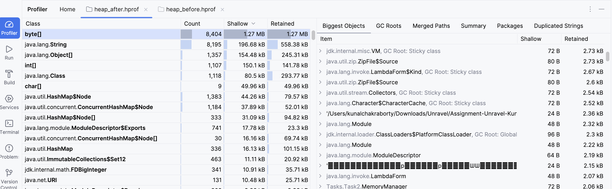

# **Simple Scenarios huge impact**

This Document contains information about the task below are the point covers in each task :

1. Goal
2. Constructions
3. Problem highlighted
4. Changes made to provide solutions
5. How to execute the code
6. Optionally Scalability

### TASK 1 : Session Management API Fix

**Goal:**

* Fix the thread-safety and exception-handling issues in the session API, and make it resilient under concurrent logins/logouts.
* Add session expiry to prevent memory buildup and keep responses user-friendly.

**Constraints:**

* Must be thread-safe under high concurrency.
* Must avoid memory leaks from expired or forgotten sessions.
* Should provide clean, maintainable code and handle errors gracefully.
* Should be extendable to distributed or production environments.

#### What I found (problem)

The original API stored sessions in a plain HashMap and looked like this:

    public String login(String userId) {
        if (sessions.containsKey(userId)) {
            return "User already logged in.";
        }
        sessions.put(userId, "SESSION_" + UUID.randomUUID().toString());
        return "Login successful. Session ID: " + sessions.get(userId);
    }

**Issues observed:**

* containsKey() + put() are not atomic — two threads could both create sessions for the same user.
* There was no session expiry, so memory kept growing until restart.
* Throwing RuntimeException on “not found” wasn’t ideal for API users.
* Could not scale across microservices — each instance held its own map.

#### What I changed (solution)

I re-implemented the SessionManager to be fully thread-safe and self-cleaning using a ConcurrentHashMap and a background cleaner thread.

**[✅] Key Changes**

* Replaced HashMap → ConcurrentHashMap to remove race conditions.
* Added TTL (Time To Live) per session — default 30 minutes (so expired sessions auto-remove).
* Added a background janitor thread that runs every minute to evict expired sessions.
* Replaced exceptions with clear string responses for user-friendliness.
* Made the TTL configurable so it can be shortened for testing or tuned for production.

Code for the solution is in [SessionManager.java](src/main/java/Tasks/Task1/SessionManager.java)

#### How to run (the demo)

Add this main() method inside SessionManager.java (or run in a separate test class):

    public static void main(String[] args) throws Exception {
        // Short TTL (5 seconds) for quick demo
        SessionManager sm = new SessionManager(5);
    
        System.out.println("=== Basic flow: user1..user4 ===");
        for (int i = 1; i <= 4; i++) {
            String user = "user" + i;
            System.out.println(user + " -> " + sm.login(user));
            System.out.println(user + " -> " + sm.getSessionDetails(user));
        }
    
        System.out.println("\n=== Duplicate login prevention (user1) ===");
        System.out.println("user1 -> " + sm.login("user1"));
    
        System.out.println("\n=== Logout test (user2) ===");
        System.out.println("user2 -> " + sm.logout("user2"));
        System.out.println("user2 -> " + sm.getSessionDetails("user2"));
    
        System.out.println("\n=== Concurrency test (many login attempts for user3) ===");
        var pool = Executors.newFixedThreadPool(8);
        for (int i = 0; i < 20; i++) {
            pool.submit(() -> System.out.println("concurrent -> " + sm.login("user3")));
        }
        pool.shutdown();
        pool.awaitTermination(3, TimeUnit.SECONDS);
    
        System.out.println("\n=== TTL expiry test (wait 6 seconds) ===");
        TimeUnit.SECONDS.sleep(6);
        System.out.println("user1 after TTL -> " + sm.getSessionDetails("user1"));
        System.out.println("user3 after TTL -> " + sm.getSessionDetails("user3"));
        System.out.println("\nDemo complete.");
    }

**IntelliJ:**

* Open Tasks/Task1/SessionManager.java.
* Right-click inside the class -> Run ‘SessionManager.main()’.
* Watch the console for login, logout, and expiry messages.

**Terminal:**

    javac -d out src/main/java/Tasks/Task1/SessionManager.java
    
    java -cp out Tasks.Task1.SessionManager

#### **Scalability & Production Notes**

The current version works safely when you run one copy of the app — for example, on your laptop or a single server.
It uses a ConcurrentHashMap, which handles many users or threads at the same time without issues.

If you later run the same code on multiple servers (like in a cloud setup), each one would keep its own copy of sessions.
To make it work correctly for all users everywhere, you can:

* Store sessions in one shared place (like Redis or a small shared database). That way, all app instances see the same sessions.
* Or use JWT tokens so each user carries their own session info, and the server doesn’t have to store it.

For this assignment, keeping it in memory is perfectly fine — it’s simple, safe, and good for a demo or small backend.

### *TASK 2 : Memory Management Issue Fix*

**Goal:**

* Fix the memory leak caused by improper session data handling and  introduce a lightweight caching mechanism that keeps memory usage under control even under high load.

**Constraints:**

* Must be thread-safe, self-cleaning (no manual removals required),  and able to scale for many concurrent users without exhausting heap memory.

#### **What I found (problem)**

The base code stored every session in a static `HashMap`:

        private static Map<String, byte[]> largeSessionData = new HashMap<>();
    
        public static void addSessionData(String sessionId) {
            largeSessionData.put(sessionId, new byte[10 * 1024 * 1024]); // 10 MB per session
        }

* Each user session allocated 10 MB, and entries were never removed unless `removeSessionData()` was called manually.
* If users disconnected unexpectedly or sessions expired without cleanup, these byte[] objects stayed in memory forever — leading to a memory leak and eventually an `OutOfMemoryError`.

The `HashMap` was also not thread-safe, so under concurrent requests it could even corrupt or lose entries.

#### What I changed (solution)

I modified the MemoryManager class to behave like a small in-memory cache that automatically removes old or idle sessions.

**[✅] Key Changes**

* Replaced HashMap → ConcurrentHashMap for thread safety.
* Added a time-to-live (TTL) rule: sessions idle for more than 5 minutes are automatically removed.
* Created a background cleaner thread that runs once per minute to evict expired entries.
* Left the code flexible so only one constant (BLOB_BYTES) controls how much memory each session uses (e.g., 100 B / 100 KB / 1 MB / 1 GB).

Code for thr solution is in [MemoryManager.java](src/main/java/Tasks/Task2/MemoryManager.java)

#### **How to run**

Create a main method and put the below code:

        public static void main(String[] args) throws Exception {
            int n = 10;
            for (int i = 0; i < n; i++) {
                MemoryManager.addSessionData("User-" + i);
            }
            System.out.println("Sessions added: " + n);
            for (int i = 0; i < 50; i++) {
                MemoryManager.getSessionData("User-" + i);
            }
            System.out.println("Waiting ~6 minutes so TTL eviction can run...");
            TimeUnit.MINUTES.sleep(6);
            System.out.println("Done. Check console for [Cleaner] logs and compare heap dumps if you took them.");
        }

**Take a heap dump (before & after cleanup)**

Create a dumps folder and capture two snapshots:

    mkdir -p dumps
    
    jcmd <pid> GC.heap_dump dumps/heap_before.hprof

run below command in terminal after the code execution once you see a message "Done. Check console for [Cleaner] logs and compare heap dumps if you took them."

_wait ~6 minutes so the 5 min TTL cleanup runs at least once_

    jcmd <pid> GC.heap_dump dumps/heap_after.hprof

Below is the before and after picture of the heap dump:

**BeforeHeapDump**

**AfterHeapDump**

**IntelliJ:** 

* Open Tasks/Task2/MemoryManager.java.
* Right-click inside the class -> Run 'MemoryManager.main()'
* Watch console logs — the [Cleaner] messages appear every minute as idle sessions are removed.

**Terminal:**

    javac -d out src/main/java/Tasks/Task2/MemoryManager.java
    
    java -cp out Tasks.Task2.MemoryManager

### TASK 3 : Implement Concurrency

**Goal:**

Implement a concurrent Producer–Consumer model where :

* Multiple producer threads generate logs
* Multiple consumers process them — but with a twist: some logs are more critical than others. 
* The system should handle priorities dynamically while still ensuring that low-priority tasks aren’t starved forever.

**Constraints:**

* Must be thread-safe under multiple producers and consumers.
* Must support dynamic prioritization (critical logs processed first).
* Must avoid starvation of lower-priority tasks.

#### What I found (problem)

The base code used a plain `LinkedList` with `wait()` and `notify()`:

    private Queue<String> logQueue = new LinkedList<>();

This worked for a single producer and consumer but had several problems:

* Not thread-safe when multiple producers/consumers run together.
* Easy to mismanage wait()/notify() calls (possible missed wake-ups).
* No concept of task priority — all logs treated the same.
* Could cause thread starvation or uneven workload distribution under high load.

#### What I changed (solution)

I re-implemented the log processor using a `PriorityBlockingQueue`, which is built for concurrent use and can automatically sort tasks by priority.

Each log entry is wrapped in a `LogTask` object that implements `Comparable<LogTask>`, allowing higher-priority logs to jump to the front of the queue.

[✅] Key Changes

* Switched from `LinkedList` -> `PriorityBlockingQueue` for safe concurrent access.
* Introduced a `LogTask` class with a `priority` field (lower number = higher priority).
* Simplified thread coordination — the queue itself handles blocking and wake-ups.
* Added multiple producer and consumer threads for realism.
* Used simple `System.out.println` messages to visualize priority order and concurrency.

This approach uses **Java’s concurrent utilities** instead of manual synchronization, making the code both simpler and safer.

#### How to run

Code for the solution is in 

* [LogProcessor.java](src/main/java/Tasks/Task3/LogProcessor.java)
* [Producer.java](src/main/java/Tasks/Task3/Producer.java)
* [Consumer.java](src/main/java/Tasks/Task3/Consumer.java)
* [LogProcessingApp.java](src/main/java/Tasks/Task3/LogProcessingApp.java)

**IntelliJ:**

* Open Tasks/Task3/LogProcessingApp.java
* Right-click -> Run 'LogProcessingApp.main()'
* Watch the console as producers add logs and consumers process them by priority.

**Terminal:**

    javac -d out src/main/java/Tasks/Task3/LogProcessor.java
    
    java -cp out Tasks.Task3.LogProcessingApp

#### What you’ll see

Example output:

    [Producer] Added: Producer-1 - log 0 (priority 3)
    [Producer] Added: Producer-2 - log 0 (priority 2)
    [Consumer Consumer-B] processed: Producer-1 - log 0 (priority 3)
    [Consumer Consumer-A] processed: Producer-2 - log 0 (priority 2)
    [Producer] Added: Producer-2 - log 1 (priority 2)
    [Consumer Consumer-B] processed: Producer-2 - log 1 (priority 2)
    [Producer] Added: Producer-1 - log 1 (priority 2)
    [Consumer Consumer-A] processed: Producer-1 - log 1 (priority 2)
    [Producer] Added: Producer-1 - log 2 (priority 1)
    [Consumer Consumer-B] processed: Producer-1 - log 2 (priority 1)
    [Producer] Added: Producer-2 - log 2 (priority 1)
    [Consumer Consumer-A] processed: Producer-2 - log 2 (priority 1)
    [Producer] Added: Producer-1 - log 3 (priority 2)
    [Consumer Consumer-B] processed: Producer-1 - log 3 (priority 2)
    [Producer] Added: Producer-2 - log 3 (priority 3)
    [Producer] Added: Producer-1 - log 4 (priority 2)
    [Consumer Consumer-A] processed: Producer-2 - log 3 (priority 3)
    [Consumer Consumer-B] processed: Producer-1 - log 4 (priority 2)
    [Producer] Added: Producer-1 - log 5 (priority 5)
    [Producer] Added: Producer-2 - log 4 (priority 5)
    [Producer] Added: Producer-2 - log 5 (priority 5)
    [Consumer Consumer-B] processed: Producer-1 - log 5 (priority 5)
    [Consumer Consumer-A] processed: Producer-2 - log 5 (priority 5)
    [Producer] Added: Producer-1 - log 6 (priority 2)
    [Producer] Added: Producer-2 - log 6 (priority 5)
    [Producer] Added: Producer-1 - log 7 (priority 5)
    [Producer] Added: Producer-2 - log 7 (priority 2)
    [Consumer Consumer-B] processed: Producer-2 - log 4 (priority 5)
    [Consumer Consumer-A] processed: Producer-1 - log 7 (priority 5)
    [Consumer Consumer-B] processed: Producer-2 - log 6 (priority 5)
    [Consumer Consumer-A] processed: Producer-1 - log 6 (priority 2)
    [Consumer Consumer-B] processed: Producer-2 - log 7 (priority 2)
    Main thread exiting...
    [Consumer Consumer-B] shutting down.
    [Consumer Consumer-A] shutting down.

The consumers always handle critical (based on priority i.e. priority 1) logs first, 
but once high-priority logs finish, lower-priority ones also get processed — ensuring no starvation.

#### Optionally for Scalability

If you need to scale this to hundreds of logs per second, you can replace manual threads with a thread pool, like so: 

    public static void main(String[] args) {
        LogProcessor processor = new LogProcessor();

        // Fixed thread pool for consumers
        ExecutorService consumers = Executors.newFixedThreadPool(3);

        // Cached thread pool for producers (auto-scales as needed)
        ExecutorService producers = Executors.newCachedThreadPool();

        // Start multiple producers
        for (int i = 0; i < 5; i++) {
            producers.submit(new Producer(processor, "Producer-"+i));
        }

        // Start multiple consumers
        for (int i = 0; i < 3; i++) {
            consumers.submit(new Consumer(processor, "Consumer-"+i));
        }

        // Let them run for a while, then shut down gracefully
        try {
            Thread.sleep(5000);
        } catch (InterruptedException ignored) {}

        producers.shutdown();
        consumers.shutdownNow();

        try {
            producers.awaitTermination(2, TimeUnit.SECONDS);
            consumers.awaitTermination(2, TimeUnit.SECONDS);
            System.out.println("Processing complete. Shutting down gracefully.");
        } catch (InterruptedException e) {
            Thread.currentThread().interrupt();
        }

    }

##### Why this matters:

* The `ExecutorService` manages thread reuse — no need to manually create or destroy threads.
* It scales gracefully as workload increases.
* The queue (`PriorityBlockingQueue`) remains the same.
* You can tune pool sizes.

### *TASK 4 : Fix Deadlock in a Multi-Threaded Environment*

**Goal**: 

* Remove a sporadic deadlock caused by inconsistent locking when many threads/users hit shared resources at the same time.

**Constraints**: 

* Must be thread-safe, scale beyond two locks, and play nicely with third-party libraries that also use locks.

#### What I found (problem)

The original pattern locked shared resources in different orders across methods (e.g., lock1 → lock2 vs. lock2 → lock1). 
Under concurrency, two threads can each hold one lock and wait forever for the other → a deadlock. 
It was hard to reproduce consistently, showing up only under higher thread counts / unlucky timing.

_when ran under high amount the deadlock start to happen_

    public static void main(String[] args) {
        DeadlockSimulator simulator = new DeadlockSimulator();
        for (int i = 0; i < 10000; i++) {
            Thread t1 = new Thread(simulator::method1, "Method1 - " + i);
            Thread t2 = new Thread(simulator::method2, "Method2 - " + i);
            t1.start();
            t2.start();
        }
    }

#### What I changed (solution)

I implemented global lock ordering so every thread acquires multiple locks in a deterministic order. 
This prevents circular waits, which removes deadlocks by construction.

**I provide two variants:**

**Simple & familiar** — 

* uses synchronized with a tiny helper to enforce order (great for teaching or very small cases).

        public class DeadlockSimulator {
            private final Object lock1 = new Object();
            private final Object lock2 = new Object();
            // deterministic order for the two locks
            private Object[] ordered(Object a, Object b) {
                return System.identityHashCode(a) < System.identityHashCode(b)
                        ? new Object[]{a, b}
                        : new Object[]{b, a};
            }
        
            public void method1() {
                var locks = ordered(lock1, lock2);
                synchronized (locks[0]) {
                    synchronized (locks[1]) {
                        System.out.println("Method1: Acquired lock1 and lock2");
                    }
                }
            }
            public void method2() {
                var locks = ordered(lock1, lock2);
                synchronized (locks[0]) {
                    synchronized (locks[1]) {
                        System.out.println("Method2: Acquired lock2 and lock1");
                    }
                }
            }
            public static void main(String[] args) {
                DeadlockSimulator simulator = new DeadlockSimulator();
                for (int i = 0; i < 10000; i++) {
                    Thread t1 = new Thread(simulator::method1, "Method1 - " + i);
                    Thread t2 = new Thread(simulator::method2, "Method2 - " + i);
                    t1.start();
                    t2.start();
                }
            }
        }

**Practical & flexible — uses ReentrantLock with:**

* an ordered locking helper (same idea as above)
* a timeout+retry path for places that might interact with third-party code that also uses locks,   so we don’t block forever if they hold something internally.

Code for this is in file [DeadlockSimulator.java](src/main/java/Tasks/Task4/DeadlockSimulator.java)

I also added a tiny deadlock detector (Deadlock Watcher) you can run during tests;  it prints to the console if a deadlock ever occurs.

#### How to run & where to see output

**IntelliJ**: 

* Run -> DeadlockSimulator.main.
* Normal prints appear in the Run console.
* The deadlock detector prints to System.err(red text).
* You can also click the Thread Dump button in the Run window to inspect live threads.

**Terminal:**

`javac -d out src/main/java/Tasks/Task4/DeadlockSimulator.java`

`java -cp out Tasks.Task4.DeadlockSimulator`

_Redirect detector output if you want:_

`java -cp out Tasks.Task4.DeadlockSimulator 2> deadlocks.log`

**Manual thread dump:**

`jcmd <pid> Thread.print or jstack <pid>` -- you should not see “Found one Java-level deadlock”.

### TASK 5 : Optimize Database Connection Pooling (HikariCP) Fix

**Goal:**

* Optimize database connection pooling using **HikariCP** for better performance and stability.
* Add a **custom monitoring solution** to track slow connections, pool saturation, and under-utilization.
* Demonstrate how to tune pool parameters based on usage patterns rather than simply increasing pool size.

**Constraints:**

* Must use **HikariCP** as the pool implementation.
* Must be thread-safe and production-ready.
* Should include **custom logs/metrics** to monitor connection waits and idle usage.
* Should be easily configurable through properties.

#### What I found (problem)

The base implementation used a **manual JDBC connection** pattern that:

* Opened new connections for every query — no pooling.
* Had **no monitoring**, so we couldn’t detect connection leaks or slow pool behavior.
* Didn’t allow configuration through properties, making tuning hard.
* Scaled poorly under concurrent DB access.

#### What I changed (solution)

I switched the implementation to use **Spring Boot + HikariCP**,  the default high-performance connection pool, and wrapped it with lightweight monitoring helpers.

[✅] Key Changes

* Introduced `DatabaseManager` — a thin wrapper around Spring’s `DataSource`.
  * Measures how long it takes to get a connection and logs when it’s “slow” (> 200 ms).
  * Ensures every connection is properly returned to the pool.
* Added `PoolMonitor` — a small scheduled component that logs every 10 seconds:
  * `active`, `idle`, `total`, and `awaiting` connections.
  * Prints alerts when threads are waiting for connections (pool too small) or when the pool is mostly idle (pool too large).
* Used Spring Boot’s configuration system [application.properties](src/main/resources/application.properties) to tune pool size, timeouts, and leak detection.
* Connected to a **PostgreSQL** database through `spring.datasource.*` properties.

Code for the solution is in:

* [DatabaseManager.java](src/main/java/Tasks/Task5/DatabaseManager.java)
* [PoolMonitor.java](src/main/java/Tasks/Task5/PoolMonitor.java)
* [DataBaseApplication.java](src/main/java/Tasks/Task5/DataBaseApplication.java)

#### Why Spring Boot and not plain Java?

The original assignment only mentioned HikariCP and a “component” annotation.
Since `@Component` and dependency injection (`@Autowired`) are Spring annotations,
the correct and production-like approach was to use **Spring Boot** instead of plain Java.

**Advantages of the Spring Boot way:**

* Automatic HikariCP configuration and lifecycle management.
* Cleaner dependency injection (`@Autowired` DataSource).
* Easy scheduling via `@Scheduled` for pool monitoring.
* Centralized configuration in `application.properties`.

This approach mirrors how real-world microservices handle database pooling — minimal boilerplate, easy tuning, and built-in safety.

**Database Configuration (used PostgreSQL)**

Below are the settings in src/main/resources/application.properties :

    # PostgreSQL connection
    spring.datasource.url=jdbc:postgresql://localhost:5432/mydb
    spring.datasource.username=myuser
    spring.datasource.password=mypassword
    
    # HikariCP configuration
    spring.datasource.hikari.maximum-pool-size=20
    spring.datasource.hikari.minimum-idle=5
    spring.datasource.hikari.connection-timeout=30000
    spring.datasource.hikari.idle-timeout=60000
    spring.datasource.hikari.max-lifetime=1800000

If you’re using a different database (e.g., MySQL, Oracle):

* Replace the `spring.datasource.url` with your DB’s JDBC URL.
* Update the Maven dependency in `pom.xml` (e.g., add `mysql-connector-j`).
* No other code changes are required — Spring Boot picks up the new driver automatically.

#### How to execute the code

For starting your application(Since the implementation is in springBoot way I am calling it application)
the code is already provided in [DataBaseApplication.java](src/main/java/Tasks/Task5/DataBaseApplication.java) which will start the application.

what it does:

* Initialize the Hikari pool.
* Warm up one connection.
* Periodically log pool statistics every 10 seconds.

**Run via IntelliJ:**

* Open `Tasks/Task5/DataBaseApplication.java`
* Right-click -> Run ‘`DataBaseApplication.main()`’
* Watch console logs for pool statistics and alerts.

Run via Terminal:

    mvn clean package`
    
    java -jar target/Assignment-1.0-SNAPSHOT.jar

    or

    mvn spring-boot:run

You should see output similar to below:

    [DB] Injected DataSource type = com.zaxxer.hikari.HikariDataSource
    
    [DB] PoolMonitor warm-up OK (opened + closed one connection).
    
    [DB] active=0 idle=5 total=5 awaiting=0
